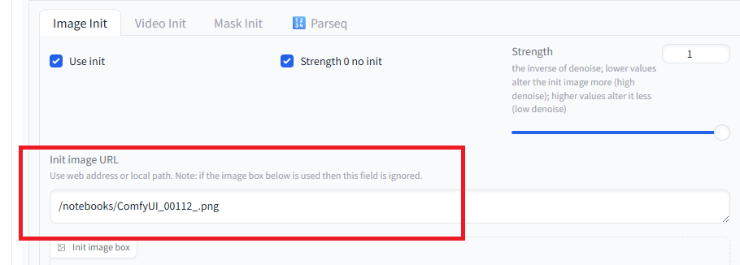
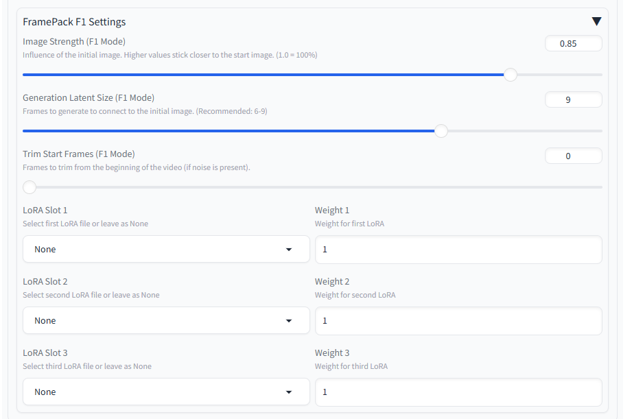
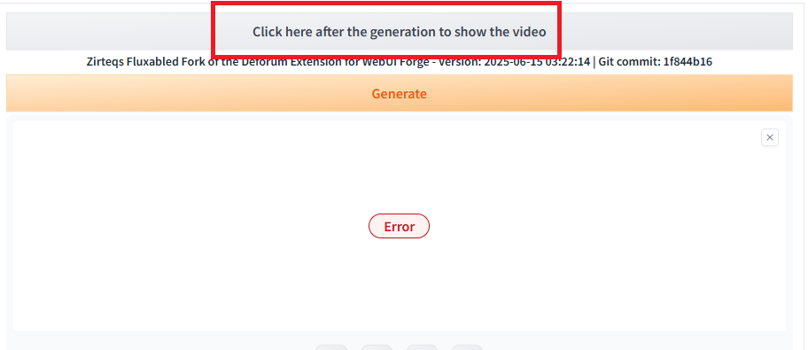

# Important: About this fork  
This is an experimental fork version designed to run the Framepack F1 model in my own environment.  
- Wan2.1 is broken if you change requirements_versions.txt in forge.

このリポジトリはFramepack F1の実装を試みた実験的なリポジトリです。

## ＜注意点１＞
FramePackモードの使用にはForgeの「requirements_versions.txt」を編集する必要があります。

```
peft==0.14.0

huggingface-hub==0.32.4
```

## ＜注意点２＞
Framepack F1 modelは、自動ダウンロードできないため、手動で、この拡張機能の「model」フォルダに配置する必要があります。

コマンドは以下

```
Your directory /stable-diffusion-webui-forge/extensions/sd-forge-deforum/scripts/framepack/
python3 model_downloader.py
```

FramePackの実装に以下のリポジトリのコードを参考にさせて頂きました。感謝します。

①　https://github.com/git-ai-code/FramePack-eichi

②　https://github.com/lllyasviel/FramePack


## ＜使える機能とかUIの説明＞
Teacache、fp8利用はデフォルトで適用しています。Loraも使用可能です。

プロンプトは「0：」の一つだけ反映されます。


フレーム数はキーフレームタブで指定でき、33の倍数が生成されます。


初期画像は「Image init」タブのURLのみ対応しています。



「Keyframes」タブの「FramePack F1」モードを選択すると、下に「FramePack F1 Settings」が表示されます。
出現しない場合は他のモードを選択して切り替えてください。



Image Strength (F1 Mode)　：　デフォルト値が１です。これを下げると動きが小さくなります

Generation Latent Size (F1 Mode)　：　1チャンクあたりのキーフレーム数です。デフォルト値が9です

Trim Start Frames (F1 Mode)　：　基本使わなくて良いかと思います

Lora　：　3個まで設定可能です。Loraフォルダ直下にあるファイルが認識されます。


生成画像のFPSはoutputタブで設定します。

## ＜UIの注意点＞



生成が終了すると「error」とUI上は表記されますが、mp4やpngファイルは問題なく作成されています。

赤枠部をクリックすると生成した動画を見る事が可能です。


# Zirteq Fluxabled Fork

Experimental fork of the [Deforum extension](https://github.com/deforum-art/sd-forge-deforum)
for [Stable Diffusion WebUI Forge](https://github.com/lllyasviel/stable-diffusion-webui-forge), 
fix'd up to work with Flux.1, integrate Parseq keyframe redistribution logic, and support **Wan 2.1 AI Video Generation**.
Integrates dynamic camera shake effects with data sourced from EatTheFutures 'Camera Shakify' Blender plugin.

## Current status

This fork of the extension is _basically working_.

&#x26A0;&#xFE0F; Configurations that use the **experimental render core** by enabling the 
new keyframe distribution feature, may require that some unsupported features are being kept disabled.

## Requirements

### Get SD WebUI Forge
Install, update and run the 'one-click installation package' of
[Stable Diffusion WebUI Forge](https://github.com/lllyasviel/stable-diffusion-webui-forge)
as described. Includes:
* Python 3.10.6
* CUDA 12.1
* Pytorch 2.3.1

Other versions _may_ work with this extension, but have not been properly tested.

### Run Flux on Forge

Get `flux1-dev-bnb-nf4-v2.safetensors` from huggingface and put it into your `<forge_install_dir>/models/Stable-diffusion/Flux`:
https://huggingface.co/lllyasviel/flux1-dev-bnb-nf4/blob/main/flux1-dev-bnb-nf4-v2.safetensors

Get the following 3 files from huggingface and put them into `<forge_install_dir>/models/VAE`
* `ae.safetensors` https://huggingface.co/black-forest-labs/FLUX.1-schnell/tree/main
* `clip_l.safetensors` https://huggingface.co/comfyanonymous/flux_text_encoders/tree/main
* `t5xxl_fp16.safetensors` https://huggingface.co/comfyanonymous/flux_text_encoders/tree/main

Restart Forge, set mode to "flux", select the flux checkpoint and all the 3 VAEs in "VAE / Text Encoder" and test with Txt2Img.

## Installation

### Directly in Forge (recommended)

Go to tab "Extensions" - "Install from URL" and use this: https://github.com/Tok/sd-forge-deforum.git

### From the commandline

Open commandline and run `<forge_install_dir>/venv/Scripts/activate.bat` 
to activate the virtual environment (venv) for Python used by Forge.

With the venv from Forge activated, do:
```
cd <forge_install_dir>/extensions
git clone https://github.com/Tok/sd-forge-deforum
cd sd-forge-deforum
pip install -r requirements.txt
```

### Update Deforum Settings

Get the latest default-settings.txt and place it directly into your 'webui' directory, then click "Load All Settings":
https://raw.githubusercontent.com/Tok/sd-forge-deforum/main/scripts/default_settings.txt
Rename it to `deforum_settings.txt` (or whatever matches the name of your settings file in the UI) and put it directly into your 'webui' directory.

&#x26A0;&#xFE0F; Some Settings are currently not properly loaded or are not persisted 
in `default_settings.txt` and may need to be set manually the first time:
* Tab "Prompts" - "Prompts negative" not resetting
  * Consider removing the defaults because they're not used with Flux.

Recommendation: **Use ForgeUIs "Settings" - "Defaults" to save your settings.**

## Wan 2.1 AI Video Generation ✨

### **Precision Text-to-Video with Deforum Integration**

The extension includes **Wan 2.1** (Alibaba's state-of-the-art video generation model) fully integrated with Deforum's scheduling system for frame-perfect video creation.

#### 🎯 **Deforum Integration Features**
- **Prompt Scheduling**: Uses Deforum's prompt system for precise clip timing
- **FPS Integration**: Single FPS setting controls both Deforum and Wan
- **Seed Scheduling**: Optional seed control from Keyframes → Seed & SubSeed tab
- **Strength Scheduling**: I2V chaining with continuity control from Keyframes → Strength tab
- **Auto-Discovery**: Automatically finds Wan models without manual configuration

#### 🤖 **AI-Powered Enhancement Features** ⚡ NEW
- **🎨 QwenPromptExpander**: Automatically enhance and expand prompts for better video quality
- **📹 Movement Analysis**: Translate Deforum movement schedules to English descriptions
- **🧠 Auto-Model Selection**: Intelligent model choice based on available VRAM
- **💾 Smart Memory Management**: Lazy loading and automatic cleanup for optimal VRAM usage
- **✏️ Manual Override**: All AI enhancements are fully editable before generation

#### 🚀 **Quick Setup**

1. **Download Wan Models** (choose one):
   ```bash
   # Recommended: VACE 1.3B model (8GB+ VRAM) - All-in-one T2V+I2V
   huggingface-cli download Wan-AI/Wan2.1-VACE-1.3B --local-dir models/wan
   
   # High Quality: VACE 14B model (16GB+ VRAM) - All-in-one T2V+I2V
   huggingface-cli download Wan-AI/Wan2.1-VACE-14B --local-dir models/wan
   
   # Alternative: Separate T2V models (no I2V chaining)
   huggingface-cli download Wan-AI/Wan2.1-T2V-1.3B --local-dir models/wan
   
   # Legacy: Separate I2V models (for compatibility with older setups)
   huggingface-cli download Wan-AI/Wan2.1-I2V-1.3B --local-dir models/wan
   huggingface-cli download Wan-AI/Wan2.1-I2V-14B --local-dir models/wan
   ```

2. **Optional: Download Qwen Models for AI Enhancement**:
   Models are auto-downloaded to `models/qwen/` when first used:
   ```bash
   # Models are automatically downloaded when "Enhance Prompts" is clicked
   # Storage location: webui-forge/webui/models/qwen/
   # Auto-selected based on your VRAM: 3B (4GB), 7B (8GB), 14B (16GB+)
   ```

3. **Configure in Deforum**:
   - Set prompts in **Prompts tab** with frame numbers
   - Set FPS in **Output tab**
   - Go to **Wan Video tab** for AI enhancement and generation options

#### 🎨 **AI Prompt Enhancement Workflow**

1. **Configure Base Prompts**:
   ```json
   {
     "0": "mountain landscape",
     "30": "misty valley", 
     "60": "golden sunlight",
     "90": "illuminated peaks"
   }
   ```

2. **Enable AI Enhancement** in Wan Video tab:
   - ✅ Enable Prompt Enhancement
   - 🤖 Select Qwen Model (Auto-Select recommended)
   - 📹 Enable Movement Analysis
   - 🎯 Click "Enhance Prompts"

3. **AI Enhanced Result**:
   ```json
   {
     "0": "A breathtaking mountain landscape at dawn, with towering snow-capped peaks rising majestically against a pristine azure sky, with camera movement with slow right pan, forward dolly",
     "30": "Morning mist gracefully rising from the valleys below, creating ethereal wisps that dance between ancient pine trees, with camera movement with medium left pan, upward tilt",
     "60": "Golden sunlight breaking through dramatic cloud formations, casting warm amber rays across the rugged terrain and illuminating every crevice, with camera movement with fast zoom in, clockwise roll",
     "90": "Full daylight illuminating the magnificent peaks in all their glory, revealing intricate details of rock formations and alpine meadows, with camera movement with slow backward dolly, downward pitch"
   }
   ```

4. **Edit and Generate**: Enhanced prompts are fully editable before clicking "Generate Wan Video"

#### 🔧 **Qwen Model Specifications**

| Model | VRAM | Type | Description | Best For |
|-------|------|------|-------------|----------|
| **QwenVL2.5_3B** | 8GB | Vision+Text | Fast, supports images | Quick enhancement |
| **QwenVL2.5_7B** | 16GB | Vision+Text | Balanced quality | Most users ⭐ |
| **Qwen2.5_3B** | 6GB | Text-only | Memory efficient | Low-VRAM systems |
| **Qwen2.5_7B** | 14GB | Text-only | High quality | Text enhancement |
| **Qwen2.5_14B** | 28GB | Text-only | Maximum quality | High-end systems |

**Auto-Selection Logic**: The system automatically chooses the best model for your VRAM:
- 4-6GB → Qwen2.5_3B
- 8-12GB → Qwen2.5_7B  
- 16GB+ → QwenVL2.5_7B or Qwen2.5_14B

#### 📹 **Movement Analysis Examples**

The system translates complex Deforum schedules into human-readable descriptions with frame-specific analysis:

| Deforum Schedule | AI Translation |
|-----------------|----------------|
| `translation_x: "0:(0), 30:(100)"` | "camera movement with moderate panning right (extended)" |
| `translation_z: "0:(0), 60:(-50)"` | "camera movement with gentle dolly backward (sustained)" |
| `rotation_3d_y: "0:(0), 45:(20)"` | "camera movement with subtle rotating right (extended)" |
| `zoom: "0:(1.0), 30:(1.5)"` | "camera movement with moderate zooming in (brief)" |

**Frame-Specific Analysis**: Each prompt gets unique movement descriptions based on its position in the video timeline:
- **Frame 0**: "camera movement with subtle panning left (sustained) and gentle tilting down (extended)"
- **Frame 43**: "camera movement with moderate panning right (brief) and subtle rotating left (sustained)"  
- **Frame 106**: "camera movement with gentle dolly forward (extended) and subtle rolling clockwise (brief)"

**Camera Shakify Integration**: When enabled, the system analyzes the actual Camera Shakify pattern at each frame position to provide varied, specific directional descriptions instead of generic "investigative handheld camera movement" text.

**Combined Example**:
```
Input: translation_x: "0:(0), 30:(100)", rotation_3d_x: "0:(0), 60:(15)", zoom: "0:(1.0), 40:(0.7)"
Camera Shakify: INVESTIGATION pattern enabled
Output: "camera movement with moderate panning right (extended), subtle tilting up (sustained), and gentle zooming out (brief)"
```

#### 💾 **Smart Memory Management**

- **Lazy Loading**: Qwen models are only loaded when "Enhance Prompts" is clicked
- **Auto-Cleanup**: Models are automatically unloaded before video generation to free VRAM
- **Manual Control**: "Cleanup Qwen Cache" button for immediate VRAM release
- **Status Monitoring**: Real-time display of loaded models and VRAM usage

#### 🎬 **VACE Models - Recommended for Seamless Video Generation**

**VACE (Video Adaptive Conditional Enhancement)** models are Wan's latest all-in-one architecture that handles both Text-to-Video and Image-to-Video generation with a single model, providing superior consistency for I2V chaining:

- **🔄 Unified Architecture**: Single model handles both T2V and I2V generation
- **🎯 Perfect Consistency**: Same model ensures visual continuity between clips
- **⚡ Efficient Memory**: No need to load separate T2V and I2V models
- **🎨 Enhanced Quality**: Latest architecture with improved video generation

#### 🎬 **Deforum Workflow Example**

```json
{
  "0": "A serene mountain landscape at dawn",
  "30": "Morning mist rising from the valleys", 
  "60": "Golden sunlight breaking through clouds",
  "90": "Full daylight illuminating the peaks"
}
```

At 30 FPS, this creates exactly 1-second clips with seamless I2V transitions using VACE's unified architecture.

#### 📊 **Model Comparison**
| Model | Type | Size | VRAM | Speed | Quality | I2V Chaining | Best For |
|-------|------|------|------|--------|---------|--------------|----------|
| **VACE-1.3B** | All-in-one | ~17GB | 8GB+ | Fast | Good | ✅ Perfect | Most Users ⭐ |
| **VACE-14B** | All-in-one | ~75GB | 16GB+ | Slow | Excellent | ✅ Perfect | High-end Systems |
| **T2V-1.3B** | T2V Only | ~17GB | 8GB+ | Fast | Good | ❌ None | Independent Clips |
| **T2V-14B** | T2V Only | ~75GB | 16GB+ | Slow | Excellent | ❌ None | Independent Clips |
| **I2V-1.3B** | I2V Only | ~17GB | 8GB+ | Fast | Good | ✅ Good | Legacy I2V Chaining |
| **I2V-14B** | I2V Only | ~75GB | 16GB+ | Slow | Excellent | ✅ Good | Legacy I2V Chaining |

**💡 Recommendation**: Use VACE models for I2V chaining workflows, T2V models only for independent clip generation.

#### 📚 **Documentation**

For comprehensive documentation, see:
- **[Wan User Guide](docs/wan/README.md)** - Complete setup and usage guide
- **[Technical Reference](docs/wan/TECHNICAL.md)** - Developer documentation

#### 🛠️ **Advanced Features**
- **I2V Chaining**: Seamless transitions between clips using last frame as starting image
- **Continuity Control**: Strength override for maximum clip-to-clip continuity
- **4n+1 Frame Calculation**: Automatic handling of Wan's frame requirements
- **Flash Attention Fallback**: Works with or without flash-attn
- **Memory Optimization**: Efficient VRAM usage for large generations
- **VACE T2V Mode**: Uses blank frame transformation for pure text-to-video generation

## Default Bunny Testrun

After installation, you can test the setup by generating the default bunny with
"Distribution" set to "Keyframes Only" and "Animation Mode" set to "3D".
This also downloads Depth-Anything V2 or the MiDaS model for depth warping when ran for the first time
and demonstrates prompt synchronization in a no-cadence setup.

The default bunnies contain 333 frames at 720p, but only 19 of them are actually diffused.
The diffused frames are placed in the clip according to the keyframes defined in the prompts.
The prompts themselves are aligned to be synchronized at 60 FPS with the beat of an 
amen break you can find linked in the settings (enable sound):

https://github.com/user-attachments/assets/5f637a04-104f-4d87-8439-15a386685a5e

If you used other versions of the Deforum plugin before, it may also be necessary
to update or adjust your Deforum settings. The latest example settings with for the default bunny can also be downloaded here:

https://github.com/Tok/sd-forge-deforum/blob/main/scripts/default_settings.txt

## What should work, what doesn't and what's untested

### Should work:

#### Wan 2.1 Video Generation
* **Text-to-Video**: High-quality AI video generation with precise frame timing
* **Auto-Discovery**: Automatic model detection and validation
* **Flash Attention Fallback**: Compatible with systems without flash-attn
* **Audio Synchronization**: Frame-perfect timing for music videos
* **Multiple Resolutions**: Support for various output sizes

#### AI-Powered Enhancements ⚡ NEW
* **QwenPromptExpander**: Automatic prompt enhancement with 5 model options (3B-14B)
* **Movement Analysis**: Translation of Deforum schedules to English descriptions
* **Auto-Model Selection**: Intelligent choice based on available VRAM (4GB-28GB)
* **Lazy Loading**: Models only load when needed, auto-unload before generation
* **Manual Editing**: All AI enhancements are fully editable before generation
* **Multi-Language**: English and Chinese prompt enhancement support
* **Dynamic Motion Strength**: Automatic calculation from movement patterns

#### Keyframe Distribution
Causes the rendering to run on an experimental core that can rearrange keyframes,
which makes it possible to set up fast generations with less jitter at high or no cadence.

##### New sub-tab under "Keyframes"
* Can now be used **with- or without- Parseq**.
* Allows for precise sync at high cadence.
* Detailed info and recommendations on new tab.

#### Asynchronous Subtitle generation
All subtitles are now generated and written to an .srt file in advance.
Complex subtitle generations should work fine with Parseq but are currently limited with Deforum-only setups.
* New Deforum setting for skipping the prompt-part to a new line in .srt files.
* New Deforum setting for choosing simple (non-technical) subtitles that contain only the text from the prompt.
  * Complex subtitles should work fine when Parseq is used, but are otherwise limited to essential information only.
  * Recommendation: turn on for now if not using Parseq
* Removed emtpy "--neg" param from being written into the subtitles
  because negative prompts are ignored in Flux workflows.
* Improved padding of technical information so subtitles jitter less.

### Camera Shakify Effects

Add camera shake effects to your renders on top of your other movement.

##### New sub-sub-tab under "Keyframes"

This feature enhances the realism of your animations by simulating natural camera movements, adding a layer of depth
and engagement to your visuals. Perfect for creating action sequences or adding a sense of spontaneity, 
it allows for customizable shake parameters to fit your specific needs.

The shake data is available under Creative Commons CC0 1.0 Universal license and was sourced from the
['Camera Shakify' Blender plugin by EatTheFuture](https://github.com/EatTheFuture/camera_shakify).

### Perhaps working (untested)
* Flux schnell
  * There's not a lot of precision for fine-tuning strength values when only 4 steps are required.
* Control Net
* Hybrid Video
* Non-Flux workflows

### Currently not working with experimental core
* Kohya HR Fix
  * may need to be left disabled
* FreeU
  * may need to be left disabled
* Control Net

### Other Stuff
* Includes a new default setup to generate default bunny at 60 FPS in 720p with keyframes only.
* Non-essential emojis can be turned off with a checkbox under "Settings" - "Deforum".
* Seed and Subseed tabs unified.

## Troubleshooting

### Wan 2.1 Issues
* **No models found**: Download Wan models using the commands above
* **Generation fails**: Try the 1.3B model if using 14B, check VRAM usage
* **Flash attention errors**: Compatibility layer should handle this automatically
* **Audio sync problems**: Verify frame numbers in prompt schedule match your timing needs

### AI Enhancement Issues (QwenPromptExpander)
* **Model download fails**: Check internet connection, models auto-download to `webui/models/qwen/`
* **Out of VRAM**: Use "Cleanup Qwen Cache" button or select smaller model (3B instead of 7B/14B)
* **Enhancement fails**: Try "Auto-Select" model option, ensure prompts are properly formatted
* **Slow enhancement**: Larger models (14B) take more time, consider using 7B or 3B for speed
* **Enhancement button not working**: Check console for errors, restart WebUI if needed

### Movement Analysis Issues
* **No movement detected**: Increase movement sensitivity or check schedule format ("frame:(value)")
* **Incorrect analysis**: Verify Deforum schedules use proper syntax, try different sensitivity settings
* **Motion strength wrong**: Enable manual override in Overrides section for custom values

### Settings file
During active development, content and structure of the `deforum_settings.txt` file 
can change quickly been updated. Settings from older versions may not behave as expected.
If necessary, the latest deforum-settings.txt are available for download here:
https://github.com/Tok/sd-forge-deforum/blob/main/scripts/default_settings.txt

### General Issues
* **Import errors**: Restart WebUI after installation
* **Missing dependencies**: Run `pip install -r requirements.txt`
* **Performance issues**: Check VRAM usage and reduce settings
